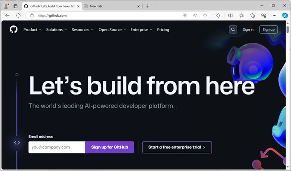
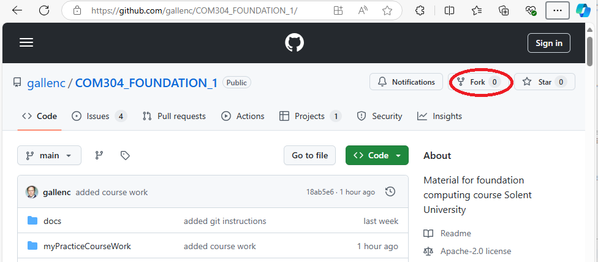
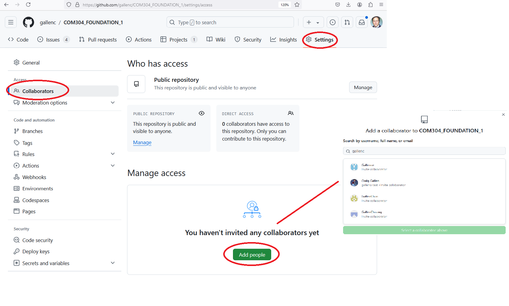

[Front Page](../../main/README.md) | [usingGit](../usingGit) 

## Setting Up and using Git 
Fundamentally, software development is a collaborative activity.
Even when you are working on your own project, you will be drawing on examples or library code written by someone else. 

Three of the most important disciplines when working on software projects individually or in teams are 
* Documentation, 
* Project Management, and 
* Version Control.

We want to introduce you to all these practices as part of this module.

Git is a version control system invented by [Linus Torvalds](https://en.wikipedia.org/wiki/Linus_Torvalds) to help track changes to code during the development of the Linux Kernel.

Git is very powerful and now very widely adopted in the computer industry, supplanting tools which were previously widely used such as [Subversion](https://subversion.apache.org/) and [CVS](https://www.nongnu.org/cvs/). 

In this module you will learn some basic commands and practices to use Git effectively.

[Github.com](https://github.com/) (now owned by Microsoft) provides a comprehensive set of free online tools for collaboratively managing software projects.
GitHub hosts online version control, issue management and project management tools. 

You will use Github to document your work, project manage your tasks and store your code for this module.

To use any of these tools, you will need to set up a personal Github account. 
Your Github account will be used by you for all the work you do during your university career.
It will become like a living CV of the projects you have worked on.

Having set up your own Github account, you will then `fork` this module repository which just means creating a clone (or copy) of this repository in your own Github account.

Forking the upstream repository into your account will allow you to maintain your own record of work based upon the tutorial material.

Forking the upstream repository will also allow your tutor to continue to work on their `upstream` copy of the material while you can work separately on your own copy.

If any changes are `committed` upstream by the tutor, you can `merge` those changes into your local repository and use them in your own work. 
You can also use this as a method for getting any example code into virtual machines or docker containers which you are using to test your work

## Setting up a Github account

If you already have a github account, you can use it for this work.
If you do not already have a personal account you will first need to create a github account at [https://github.com](https://github.com)

   
   
This is your personal account which will live on after your university career.
Many employers look at personal github accounts of potential employees to understand what projects they have worked on and their level of skill.

Choose your github username wisely, it is unique and you will probably have to live with it for a long time :)

You can add personal details and a picture to your profile if you wish.
You don't have to use your university email for this account if you don't wish to. 
You may have to set up your mobile phone number and/or a personal authenticator app to allow 2 factor authentication.

## Forking this module's repository
Once you have set up your own account, you can `fork` the course examples repository.

Log into your own account using your username and password.

Navigate to the class examples `upstream` repository at [https://github.com/gallenc/COM615_Network-Management_1](https://github.com/gallenc/COM615_Network-Management_1)

Press the `Fork` button and follow any instructions to fork the repository into your own account.

   

This will create a `clone` (or copy) of the `upstream` repository in your own account. 

Navigate to your own cloned repository at https://github.com/_YOUR_USERNAME_/COM615_Network-Management_1/
(Where _YOUR_USERNAME_ is the username you chose for your github account)

This is your own copy which you can modify and use as your choose.
You cannot write to the `upstream` repository but you can write to this `forked` repo.

---
**NOTE**

* Your personal work in your repository will be part of the assessment.
* By default you will be creating a `public` repository, which means anyone can look at it (but not modify it). 
  You could make this private and restrict access but we do not need to do this in this class.
  (You will be creating your own personal learning record from this repo - but it will be easy to spot if this is not your own work when marking the submission)

---

You may want to make your tutor a collaborator on your project as this will allow him to track your progress 
(In future, if you are working together with another student on the same code, you may also want to make your partner a collaborator).

On the repository top page, select the `Settings` tab.

Select Collaborators and search for the username of the collaborator you are adding. 
Your tutor's username is `gallenc`.

   

## Checking out your code and merging the upstream repo

Having created your github account and created your first clone, you now want to check out the repository locally and merge any upstream changes.

Detailed instructions on setting up github security, checking out code and merging upstream changes are given in  [Introduction to Github](../usingGit/docs/introductionToGitHub.md) 
